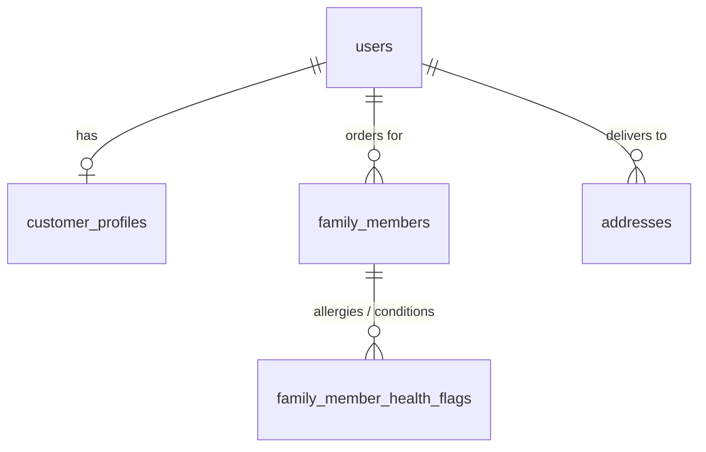

# PharmaSync

Pharmacy management system. Group 46, Academic Year 2026/2027.

PHP with MVC, MySQL, XAMPP. **No frameworks, no CDN links.**

---

## Setup

1. Clone into `C:\xampp\htdocs\`. The folder can be named anything -
   `BASE_URL` is detected automatically.
2. Start Apache and MySQL in the XAMPP control panel.
3. Open `http://localhost/<your-folder-name>/public`

The project runs immediately on sample data - `DB_ENABLED` is `false`, so no
database import is needed yet. You land on the login page; sign in with one
of the demo accounts below.

When the group is ready for MySQL, import the files in `database/` in name
order (`001_schema.sql`, `001a_seed_demo_users.sql`, `002_...`, `003_...`) in
phpMyAdmin and flip `DB_ENABLED` to `true`. The demo logins stay the same.

### Customer CRUD on MySQL (interim)

The customer CRUD - family members, their allergies and conditions, and
saved addresses - can run on a real database while everything else stays on
sample data:

1. Start MySQL in XAMPP, open phpMyAdmin > **Import**, choose
   `database/003_add_customer_profile_tables.sql` and click **Import**. It
   creates the `pharmasync` database, the tables below and the demo accounts.
2. In `config/config.php` set `CUSTOMER_DB_ENABLED` to `true`.
3. Log in as customer@pharmasync.com and open **Profile**. Every add, edit and
   delete now shows up in phpMyAdmin.

Logins and registrations also go to MySQL while this is on, because the CRUD
tables belong to a row in `users`.



### Demo accounts

Every password is `Demo@1234`.

| Role              | Email                       |
|-------------------|-----------------------------|
| Customer          | customer@pharmasync.com     |
| Pharmacist        | pharmacist@pharmasync.com   |
| Admin             | admin@pharmasync.com        |
| Inventory Manager | inventory@pharmasync.com    |
| Delivery Partner  | delivery@pharmasync.com     |

While `DB_ENABLED` is `false` these live in `storage/users.json`, which is
created on the first login and is git-ignored. New customer registrations are
saved there too. Delete the file to reset every account.

If every page 404s, `mod_rewrite` is off. Open `C:\xampp\apache\conf\httpd.conf`,
uncomment `LoadModule rewrite_module modules/mod_rewrite.so`, set
`AllowOverride All`, restart Apache.

**Do not edit `config/config.php` for your own machine.** If something there
is wrong, it is wrong for everyone - tell the group.

---

## Which files are yours

```
config/
  config.php           SHARED. Group agreement only.
  helpers.php          SHARED. Add a helper here only if all five roles use it.
  routes.php           SHARED loader. You never edit this.
  routes/
    customer.php       Mithun
    pharmacist.php     <name>
    admin.php          <name>
    inventoryManager.php  <name>
    deliveryPartner.php   <name>
    authentication.php    <name>
    shared.php         SHARED - the site root only

app/
  core/                FROZEN. Router, Controller, Model, Database, Session,
                       Mailer. Never edit these on a feature branch.
  controllers/         FLAT. Your files are <Role><Feature>Controller.php
  models/              FLAT. Shared - see "Models are shared" below.
  views/
    layouts/           shared pieces
    errors/            404, 403
    authentication/    login + register (one page, two tabs), forgot password
    customer/          Mithun
    pharmacist/        <name>
    admin/             <name>
    InventoryManager/  <name>
    deliveryPartner/   <name>

public/
  index.php            Front controller. Every request enters here.
  assets/
    css/main.css       SHARED base styles
    css/<Role>/        Your own stylesheets. PascalCase folder.
    icons/             Lucide SVGs, inlined by icon(). Shared.
    images/, js/, videos/

database/              SQL files, numbered in run order.
storage/prescriptions/ Uploads. NOT reachable from a browser.
storage/users.json     Local accounts while DB_ENABLED is false. Git-ignored.
lib/                   Third-party code. See "PHPMailer" below.
dev/                   Scratch space. Notes, sketches, throwaway scripts.
```

Controllers and models are **flat**, not in role folders. The role is part of
the filename: `CustomerCartController.php`, `PharmacistQueueController.php`.
This matches what is already committed to GitHub.

---

## URLs

Every page lives under its role:

```
/customer/cart              /pharmacist/queue
/customer/orders/17         /admin/users
/InventoryManager/stock     /deliveryPartner/routes
/authentication/login
```

That prefix is the whole point. Without it, five people's `/dashboard`,
`/notifications` and `/settings` routes overwrite each other the day we merge.

You do **not** type the prefix. In `config/routes/<yours>.php` you write:

```php
'GET  /dashboard'     => ['PharmacistDashboardController', 'index'],
'GET  /orders/{id}'   => ['PharmacistOrderController', 'show'],
```

and the loader turns those into `/pharmacist/dashboard` and
`/pharmacist/orders/17`. `{id}` is passed to the method as an argument.

**The first matching route wins**, so put longer paths above shorter ones.

---

## Adding a page - the whole loop

**1. Route** - in your own file, `config/routes/<yours>.php`:

```php
'GET  /stock/{id}' => ['InventoryManagerStockController', 'show'],
```

**2. Controller** - `app/controllers/InventoryManagerStockController.php`:

```php
class InventoryManagerStockController extends Controller
{
    protected string $viewBase = 'InventoryManager';   // your views folder

    public function show(int $id): void
    {
        $this->requireRole('Inventory_Manager');       // first line, always

        $batch = (new StockBatch())->find($id);

        if (!$batch) {
            $this->notFound();
        }

        $this->render('stock/show', ['batch' => $batch]);
    }
}
```

**3. View** - `app/views/InventoryManager/stock/show.php`. Print with `e()`:

```php
<h1><?= e($batch['medicine_name']) ?></h1>
<p><?= money($batch['unit_price']) ?> - expires <?= dt($batch['expiry_date'], 'd M Y') ?></p>
<a href="<?= url('/InventoryManager/stock') ?>">Back to stock</a>
```

`render()` wraps your page in `app/views/<yourfolder>/partials/header.php` and
`footer.php` if those two files exist, and renders the page on its own if they
do not. So build your layout whenever you like. Use `renderBare()` for print
pages and AJAX fragments.

---

## Rules that stop merge conflicts

**Never hardcode a URL.** Use `url('/customer/cart')` and
`asset('assets/css/main.css')`. Hardcoded paths break the moment someone
clones into a differently named folder.

**Never edit `app/core/`.** If you need something from it, ask the group and
it gets changed once, on `develop`.

**Every POST form** carries `<?= csrf_field() ?>`, and **every POST handler**
starts with `$this->verifyCsrf();`. The field is named `_csrf`.

**Every page method** starts with `$this->requireRole('Your_Role')` - the
database spelling (`Inventory_Manager`), not the URL spelling. That is what
stops a customer from opening the admin pages.

**All SQL lives in models.** Never in a controller, never in a view. Always a
prepared statement, never a variable concatenated into a query string.

**Escape everything you print** with `e()`. Forgetting it is how XSS happens.

---

## Sessions and the signed-in user

One array, `$_SESSION['user']`, holding at least `id`, `role` and `name`.
Read it through `Session`, not directly:

```php
Session::isLoggedIn();    Session::user();     Session::id();
Session::role();          Session::roleSlug(); Session::name();
```

Inside a controller, `$this->currentUser()` gives you the same array.

### Guests

Anyone who opens the site address sees the public landing page
(`app/views/customer/home/index.php`, shown by `HomeController` at `/`).
Guests can browse the catalog, search, open product pages and fill the cart
without logging in (`CustomerGuestAccess` trait). Checkout, prescriptions,
orders, profile, notifications, settings and the dashboard ask them to log
in and then send them back to the page they wanted, cart included.
Signed-in staff who open a shop page are sent to their own dashboard.

Authentication is **real**: `AuthenticationController` + `app/models/User.php`
check the email and a bcrypt `password_hash` against the `users` table (or
`storage/users.json` while `DB_ENABLED` is `false`), block accounts whose
status is not `Active`, and hand `Session::login()` an array with `id`,
`role` and `name` plus email, phone, address and dob. There is no demo
auto-sign-in any more - every page sends a signed-out visitor to
`/authentication/login` and back to the page they wanted afterwards.

Registration creates **Customer** accounts only. Staff accounts come from the
seed file (and later from the Admin module).

Logout is a POST with CSRF, so it cannot be triggered by a link on another
site. Add a sign-out button to your own module like this:

```php
<form method="post" action="<?= url('/' . AUTH_SLUG . '/logout') ?>">
    <?= csrf_field() ?>
    <button type="submit">Sign out</button>
</form>
```

---

## Models are shared

`app/models/` is flat and shared. Two modules cannot both have a class with
the same name, so when two modules need the same table, **the module that
writes the table owns the base class** and the others extend it.

`Medicine` belongs to the Inventory Manager (create, update, delete). The
customer module uses `CustomerMedicine` for browsing (featured, search,
filters, alternatives, recently viewed). For the interim it stands alone on
sample data; once the database is on it becomes
`class CustomerMedicine extends Medicine` (steps are in the file's header).

`Cart`, `Address`, `FamilyMember`, `Customer` and `Notification` are
customer-only. `Order` and `Prescription` are also used by the pharmacist and
delivery modules - agree who owns each before both branches write one.

The base `Model` gives you `fetchAll()`, `fetchOne()`, `fetchValue()`,
`exec()`, `insertRow()` and `updateRow()`. They are named that way, and not
`all()` / `one()` / `insert()` / `update()`, because models already use the
short names for their own business methods and PHP will not allow a child
class to redeclare a parent method with a different signature. Do not rename
them back.

Rows come back as **associative arrays** (`$row['name']`), not objects. Every
view in the project is written that way.

---

## Sample data while there is no database

`DB_ENABLED` is `false`, so `Model::db()` returns `null` and each model seeds
its own sample data into the session. Two things to remember:

- List your session keys in `SEEDED_SESSION_KEYS` in `config.php`.
- **Bump `SEED_VERSION`** whenever you change the shape of a seed array.
  Otherwise an old browser session keeps serving the old shape and fields you
  just added come out blank. There is no logout button to clear it by hand.

Keep your sample data shaped like the columns in `database/001_schema.sql`,
so that switching `DB_ENABLED` on later changes the model and nothing else.

---

## Icons

`icon('shopping-cart')` inlines an SVG from `public/assets/icons/`. No icon
font, no JavaScript, no CDN. They inherit the surrounding text colour and are
sized in `em`. An unknown name renders nothing rather than a broken box.
Drop new Lucide SVGs into that folder to use them.

---

## Open group decisions

1. **Database schema.** `database/001_schema.sql` is the shared one: `users`
   plus role profile tables, stock, purchase orders, deliveries.
   `database/schema-reference-customer.sql` is the customer module's older
   customer-only draft, kept for reference - its table names do not match.
   Reconcile the two before anyone turns `DB_ENABLED` on.
2. **PHPMailer.** `lib/PHPMailer/` holds a README, not the library. `Mailer`
   checks for the files and is also gated behind `MAIL_ENABLED` (false), so
   checkout works with email simply skipped. Decide whether we bundle the
   library or drop back to `mail()`.
3. **Route file owners.** Each file in `config/routes/` says
   `Owner: <put your name here>`. Fill yours in.
